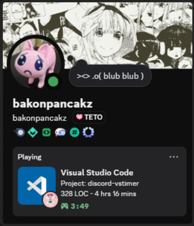

# ⌚ `trackpad`
Visual Studio Code Extension that displays your current [Wakatime](https://wakatime.com/) and Lines of Code as your Discord Activity. So you can finally prove to all your friends that you are, in fact, a 10x dev.

<p align="center">
    
    <h6 align="center">yep thats my profile</h6>
</p>

---

### 🚀 Setup
If you trust me, you can grab the compiled extension from the [Releases](/releases) tab. Or if you're rightfully paranoid (respect), you can install dependencies and build it yourself:

```bash
npm install
npm run build
```

After installion search for `Trackpad` in your VS Code settings and paste in your Wakatime API key.
Otherwise, it'll always show **0s**, and everyone will think you're a *pleb*.

*Note: This extension doesn't actually track anything so you'll still need the [Wakatime Extension](https://wakatime.com/vs-code)*

*Double Note: Your Discord activity updates every five minutes in order to keep overhead low. If it's too slow, open the Command Palette and run `Trackpad: Refresh Discord Rich Presence`*


### 🔧 Configuration
You can customize the Discord Activity Details and State fields using simple templates:
```yaml
{workspace.name}    : trackpad
{workspace.loc}     : 1,234
{wakatime.decimal}  : 1.5
{wakatime.digital}  : 1:30
{wakatime.seconds}  : 5400
{wakatime.text}     : 1hr 30mins
```
All configuration can be done in your VS Code settings UI or directly in settings.json.

Heres the defaults in-case you lost them:
```json
"trackpad.activityDetails": "Project: {workspace.name}",
"trackpad.activityState": "{workspace.loc} LOC - {wakatime.text}",
```

---

### 💡 Bonus
If you also stan Teto, throw this in your settings.json:

```json
"trackpad.overrideSmallText": "Science!",
"trackpad.overrideSmallIcon": "https://c.panca.kz/images/teto_science.gif",
```